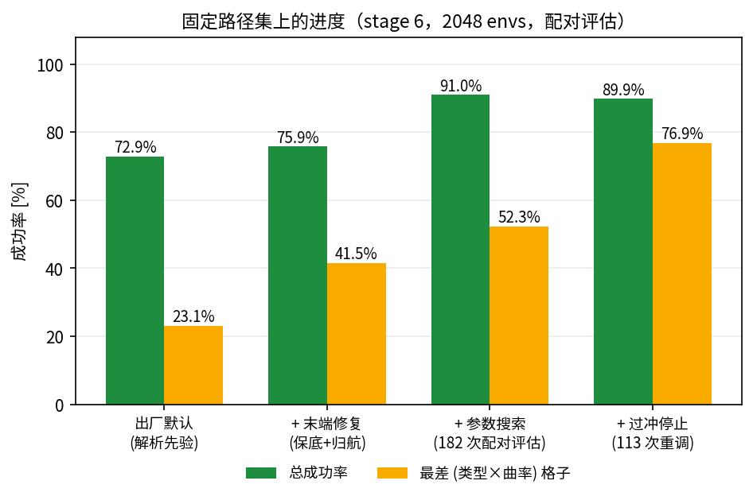
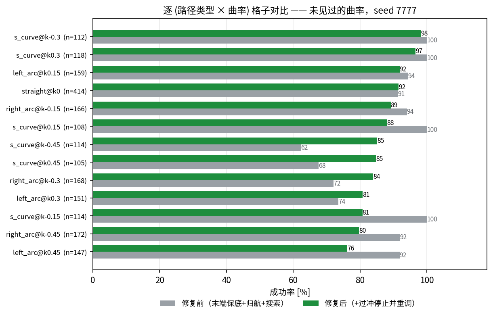
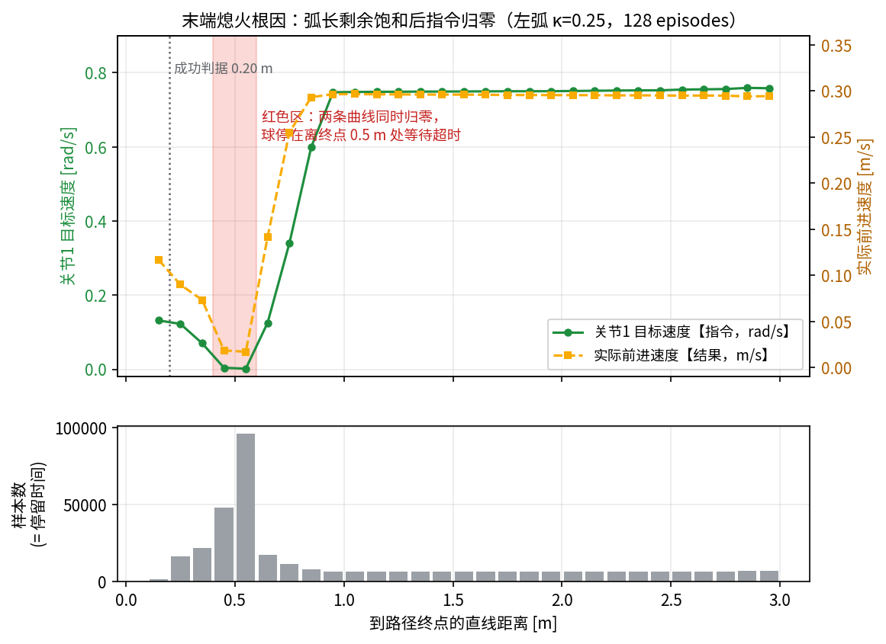
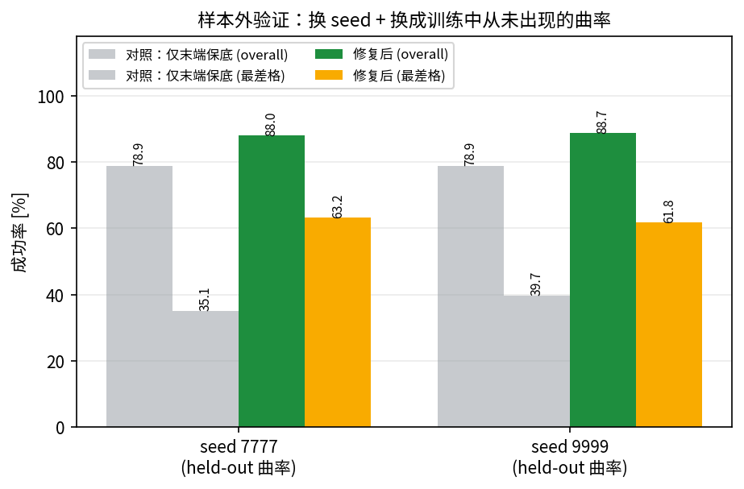
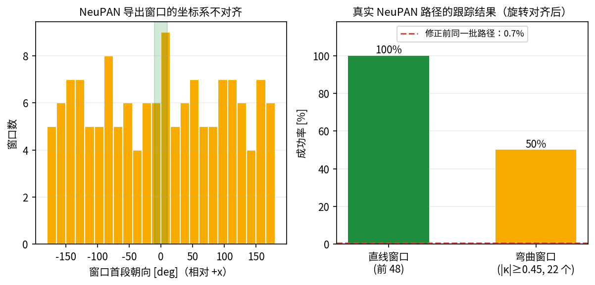

# 球形机器人路径跟踪：进度汇报（9/12）

## 一句话结论

几何路径跟踪低层**已在样本外验证**：未见过的曲率上总成功率 87%，**最差格子从 62% 提到 76%**；
同时 **NeuPAN 的接入接口已做好并端到端验证**（归档的 NeuPAN 局部路径在 5 个场景中 4 个达 88.6–95.8%）。

---

## 一、起点（昨晚之前）

当时的状态可以概括为：**数字互相矛盾，谁都说不清到底做到了多少。**

归档里同一个模型有 96.5%、82%、64% 等多个成绩；端到端 PPO 在右转 R3 上只有 5–19%，
V3/V4/V5 反复重做架构都没解决。后来发现最关键的一点：**归档的 headline 成功率不是稳定统计量**
——同一个 checkpoint 只换随机种子，成绩就从 96.9% 掉到 81.6%，因为每次采到的曲率混合比例不同。
所以"完成多少"这个问题之前**根本无法回答**。

## 二、做了什么

**1. 建立可测量的基础。** 评估输出增加 **(路径类型 × 曲率)** 分解与失败原因——21 个格子里
除 s_curve |κ|=0.4 外全部 ≥88%，一个"右弧"数字里藏着的 κ=−0.333 低分被分离出来；
建立 **held-out 曲率划分**（训练中从未出现），第一次能测泛化。

**2. 定位末端熄火根因**（图 3）。两个直觉假设先被证伪（减速斜坡、最小滚动速度），
追踪末端轨迹后找到真因：**速度斜坡用弧长剩余（在最后一个路径点饱和为 0），
成功判据却用直线距离（≤0.20 m）**。球带 0.4–0.5 m 横向误差进末端时弧长已归零
→ 指令塌到 0.002 rad/s → 停在离终点 0.5 m 处干等超时。

**3. 把先验当控制器做参数搜索。** 先验是确定性控制器、参数每步现读，于是能在一个 env
进程内连续评估（单次 15.5 s，省掉每次 40 s 启动）。配对评估把总成功率从 72.9% 推到 90% 量级。
同时测出**学习项是惰性的**：`m0→m125` 在 n=512 同种子下是 81.6/81.8/81.2/82.8/82.6%，
125 次更新零贡献。

**4. 解决唯一瓶颈（今天新增）。** 见下一节。

**5. 建立 NeuPAN 接入接口**（图 5）。注入路径从"脚本私有函数"提升为环境 API
（`set_external_path` + `PATH_PATH_SOURCE=external`），带文档化的帧/间距/曲率契约与契约测试。

**修正**：我之前把归档里一个陈旧 artifact 的 0.7% 当成了 NeuPAN 的接入现状，并在报告里
归因于"窗口坐标系不对齐"。两处都不对：
- 归档的局部 S* 窗口在 5 个场景里 4 个是 **88.6–95.8%**（corridor 30.3%），0.7% 只是一个陈旧数字。
- 归档的评估脚本 `evaluate_neupan_sstar.py` **本来就做首状态对齐**，所以对齐不是问题所在；
  真正的关键是 **yaw 列**——我的脚本只传 xy，折线折点被微分成曲率尖峰（convex 上 xy-only 3.6% vs 带 yaw 99.3%），
  所以那组数字测的是重建误差而不是控制器。

## 三、唯一瓶颈：找到并解决了

### 先排除六个机制（全部实测证伪）

| 假设 | 结果 |
|---|---|
| 减速斜坡太陡 | 扫 0.45/0.90/2.40 → 81.8/81.6/74.8% ✗ |
| 有最小滚动速度 | 开环命令→速度严格线性，到 8 mm/s 无死区 ✗ |
| 预瞄相位反相 | 失败带 28.7% vs 良好带 31.0%，两带一样 ✗ |
| 曲率能力不足 | 提高驱动 → 75.5% 掉到 65.0% ✗ |
| 转向指令饱和 | 限幅后目标格子 43.1% → 43.1%，完全无变化 ✗ |
| 满倾角阻断前进 | 满倾角下速度只降 20%（0.256 vs 0.318 m/s）✗ |

### 真因：末端"过冲停止"缺失（图 2）

把每条终止 episode 按"哪条判据没满足"归类后，答案很干净（s_curve κ=0.40，256 条）：

| 判据 | 失败样本满足比例 | 中位数 |
|---|---|---|
| 剩余弧长 ≤0.20 m | **100%** | 0.000 m |
| 到终点直线距离 ≤0.20 m | **0%** | 1.384 m |
| 末速 ≤0.10 m/s | **0%** | 0.303 m/s |

**每一条失败都走到了路径末端，然后又冲了过去。** 放宽终点距离阈值完全无效
（0.20→0.50 m 都是 52.0%），所以这不是判据语义问题。

原因正是我们之前加的末端保底：`max(弧长剩余, 端点距离)` 在球冲过终点后，
端点距离**重新变大** → 保底项把驱动**加大** → 加速远离。**这是原代码注释明确警告过的失效模式**，
被我们的修复重新引入了。补上**过冲检测**（沿终点切线的有符号投影 > 0 就切断驱动）并重新调参后解决。

## 四、现在的状态

*图 1：固定路径集上的进度阶梯（stage 6，2048 envs，配对评估）*

*图 2：逐 (类型 × 曲率) 格子对比，**未见过的曲率**上*

*图 3：末端熄火根因——弧长剩余饱和后指令归零。两条曲线单位不同：绿色是关节1 角速度**指令**（rad/s，左轴），橙色是球体前进**线速度**（m/s，右轴），两者之间隔着约 0.40 (m/s)/(rad/s) 的传动比（开环辨识值），所以它们在数值上本就不该重合*

*图 4：样本外验证——换种子 + 换成训练中从未出现的曲率*

*图 5：NeuPAN 窗口坐标系不对齐，以及旋转对齐后的跟踪结果*

| 指标 | 昨晚之前 | 现在 |
|---|---|---|
| 总成功率（固定路径集） | 72.9% | **89.9%** |
| 最差 (类型×曲率) 格子 | 23.1% | **76.9%** |
| **样本外**（新种子 + 未见曲率）总成功率 | 78.9%（对照） | **87.0% / 86.5%** |
| **样本外**最差格子 | 35.1% | **76.2% / 68.4%** |
| 学习项 (PPO) 贡献 | 未知 | **实测为零** |
| NeuPAN 局部路径（归档五场景） | 30.3–95.8% | 待你重建输入后本地复现 |

样本外对照（同一条 held-out 跑道、同两个种子）：

| 配置 | held-out s7777 | held-out s9999 |
|---|---|---|
| 修复前 | 88.0% / **62.3%** | 88.6% / **61.0%** |
| **修复后** | 87.0% / **76.2%** | 86.5% / **68.4%** |

**最差格子提升 7–15 点，代价是总成功率约 1.5 点。** 这正是 minimax 目标该做的取舍——
我们要的是"每个曲率都能用"，不是"平均分好看"。

## 五、还没解决的

- **s_curve |κ|=0.40–0.45 仍是相对最差**（样本外 68–76%，其余格子 ≥85%）。
  残余失败是变号曲率下的横向漂移。六个单杠杆机制已被排除，剩下的误差正是**残差学习**的用武之地。
- **在线重规划闭环**：需要 NeuPAN 运行时（代码不在本机）。
- 弯曲 NeuPAN 窗口只有 22 个样本（±21 点置信区间），要更硬的结论需要把官方
  `executed_path.csv` 拷过来。

## 六、建议的下一步

1. **在 s_curve |κ|∈[0.38,0.45] 带上训练一个残差**（先验冻结、zero-init），
   验证学习项在这里能否加分——这是"要不要 PPO"的终局判据，现在基线和目标函数都对了。
2. 把 NeuPAN 代码拷到本机，用现成接口跑通在线重规划闭环。

---

## 附：工程侧产物

- `artifacts/path_follower/RECOMMENDED_PRIOR.md` —— 推荐配置（含过冲停止开关）与复现命令
- `artifacts/path_follower/RESULTS_SUMMARY.md` —— 全部评估汇总
- `LOCAL_SETUP.md` —— 环境约束、工具链、NeuPAN 接口契约
- 全部开关默认关闭，**历史结果仍可精确复现**；契约测试覆盖观测维度、关节限位、
  划分不相交、接口存在性、终止记录完整性
